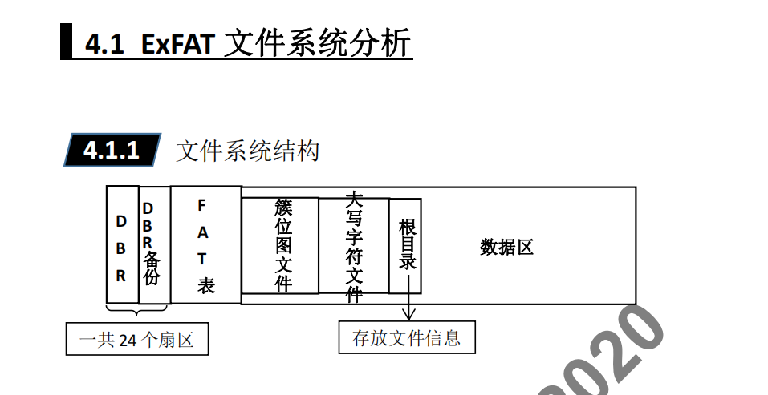
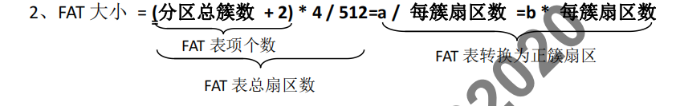

# ExFat File System 结构解析
- ### DBR 和 DBR备份 一共24个扇区
- ### FAT表
- ### 存放文件信息
  - ### 簇位图文件
  - ### 大写字符文件
  - ### 根目录
  - ### 数据区
 
 ---
 - ## ExFAT
    1. ExFAT 文件系统的 "簇" 从 **<u>簇位图文件</u>**
    2. ExFAT 文件系统只有 **1** 个 FAT 表
  ---
  - ## DBR解析
  |   偏移位置  |  字节数  |  含义    |   算法    |
  |  ----           |   ----     | ----      |  ----     |
  | 0x00 ~ 0x02 |   3     |   跳转指令  |   固定 "EB 76 90 H |
  | 0x03 ~ 0x0A |   8    |  OEM 代号  |   ASCII 码 : EXFAT |
  | 0x40 ~ 0x43 |   4   | 当前 DBR 位置 |              |
  | 0x48 ~ 0x4B |   4   | 分区大小 (包含备份 DBR ) | (下一分区开始 - 本分区开始) |
  | 0x50 ~ 0x53 |   4   | FAT 表起始位置 | 向下搜索 "**F8 FF FF** H" |
  | 0x54 ~ 0x57 |   4   | FAT 大小 | (分区总簇数 + 2 ) * 4 /  512 = a / 每簇扇区数 = b * 每簇扇区数 |
  | 0x58 ~ 0x5B |   4   | 簇位图起始位置  | 在FAT表结束搜索 "!00 H" |
  | 0x5C ~ 0x5F |   4   |  分区总簇数  |  (下一分区开始 - 本分区簇位图位置) / 每簇扇区数 |
  | 0x60 ~ 0x63 |   4   | 根目录首簇号 | 查看 FAT 表的 4 号项 |
  | 0x6C |  1  |  每扇区字节数 (2的次方数) | 固定 9 : 512=2[^9] |
  | 0x6D |  1  | 每簇扇区数 (2的次方数) | 查看 FAT 中的 2 号项一共占了几个簇，跳转到簇位图文件起始位置，向下搜索 00 00 01 00 H，定位到**大写字符文件** |
  | 0x1FE ~ 0x1FF |   2   | 结束标志 | 55 AA H |
  - ### 注释 :
  1. ExFAT 的 簇 从 "簇位图文件" 开始定义
  - 
---
 - ## FAT表和簇位图文件结构分析
     - FAT 表结构分析
       - ExFAT 的 FAT 表仅仅可以表示文件的**前后链接关系**，无法体现簇的使用情况。 FAT 表只为**没有连续存放**的文件分配 FAT 表项，连续存放的文件不分配。

    | F8 FF FF FFH | FAT表开始 |
    | ---- | ---- |
    | FF FF FF FFH |  文件结束   |

    - **<u>2、3、4 号 FAT 项分别对应：簇位图文件、大写字符文件、根目录</u>**
    - 误删除文件时，ExFAT **不会对 FAT 中做任何操作**，只是更改根目录中文件目录项的 0x00
    - 格式化分区时，ExFAT 只会 **清空 FAT 的第一个扇区**

  - 簇位图简介  
  簇位图用于记录分区”簇”的使用情况，**”簇”从簇位图开始定义**，簇位图是数据区的开始。
---
