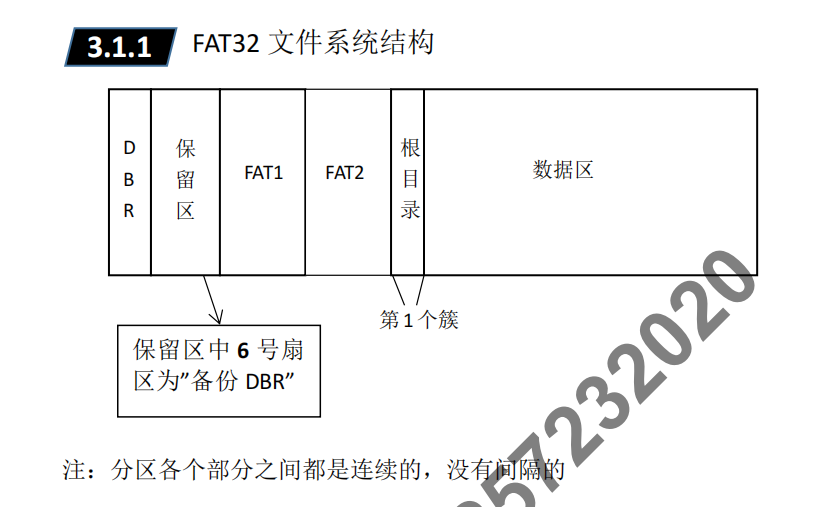
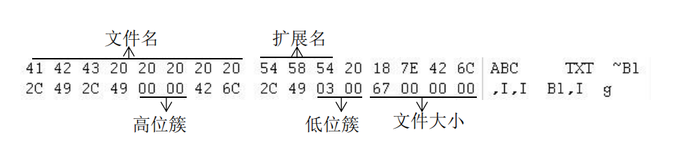
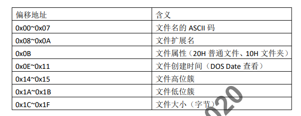
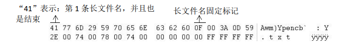
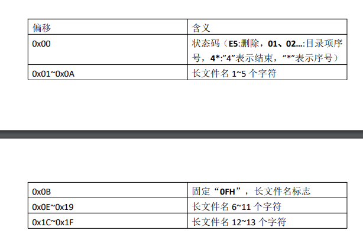
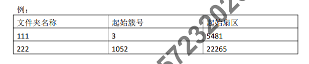

# 复制十六进制数据要使用 Ctrl + Shift + C
# winhex 一次最多搜索 50 个字节
# Ctrl+Shirt+N 存储数据为文件。
# 重要概念
  1. 扇区 ： 扇区是**分区**的基本单位 ， 一般为 **512 字节** 每扇区,从 **0** 开始编号
  2. 簇 ： 文件系统 **存储数据**的基本单位，簇大小数 **2** 的整数次幂,最大 **128**_扇区_ 每簇
  3. FAT表 ： _**文件分配表**_ ， 用于描述 **簇的分配状态** 及 **文件内容前后链接关系** 的表格
  4. 根目录首簇号 : **数据区的开始**位置 (一般为**2**号簇)

 ## FAT32 File System 解析
  - ### DBR
  - ### 保留区 _保留区中6号扇区为“备份DBR”_
  - ### FAT1
  - ### FAT2
  - ### 根目录 _**第一个簇**_
  - ### 数据区
# DBR
  ## FAT32文件系统解析
  
  ___
## 2. DBR 数据结构
| 偏移地址  | 含义  |
|  ----  | ----  |
| 0x00 ~ 0x02 | 跳转指令 |
| 0x0B ~ 0x0C | 每扇区字节数 |
| ^**0x0D** | **每簇扇区数** |
| ^**0x0E ~ 0x0F**| **保留扇区数 DBR到FAT1 的距离** |
| ^**0x10** | **FAT(表)个数** **FAT32默认是** **_2_** |
| 0x15 | 介质类型 |
| ^**0x1c ~ 0x1F**| **隐藏扇区数 即MBR到DBR的扇区数** |
| ^**0x20 ~ 0x23**| **分区总大小** |
| ^**0x24 ~ 0x27**| **FAT大小** |
| ^**0x32 ~ 0x33**| **DBR备份位置 默认自DBR起第6号扇区** |
| 0x52 ~ 0x59| 文件系统类型 |
| ^**0x1FE ~ 0x1FF** | **结束标志 一定是 “55 AA”** |

---

## 3. 修复DBR
  - 修复 _FAT32 DBR_ 时需要修改的数据有 **隐藏扇区数** , **分区总大小** , **保留扇区数** , **FAT表大小** , **每簇扇区数** 。
  1. 新建一个 FAT32 文件系统，将其 DBR **复制**,**写入** 到破坏的 FAT32 的 DBR 处 。
  2. 计算保留扇区数
     - 从 DBR 处向下搜索 “F8FFFF0F”, 到达 FAT1
     - FAT1 所在的扇区数 - DBR 所在扇区数 = 保留扇区数大小
  3. 计算 FAT 表大小
     - 从 FAT1 向下搜索 “F8FFFF0F”，到达 FAT2
     - FAT2 所在扇区数 - FAT1 所在扇区数 = FAT 表大小
  4. 查看 隐藏扇区数大小 和 分区大小
     - 从 _MBR_ 的 分区表 处查看分区的 隐藏扇区数大小 和 分区大小  
  5. 计算 每簇扇区数
     - 数据区总扇区数 / 数据区总簇数 = 每簇扇区数
     - 数据区总扇区数 = 分区大小 - 2 * FAT表大小 - 保留扇区数大小
     - 数据区总簇数 = 512 * FAT表大小 / 4
  6. 将计算的重要数据填入被破坏的 FAT32 文件系统 DBR 中对应的位置
---
# 根目录 和 短文件名目录项 分析
## 根目录分析
   - 根目录位置：
      - 1. 通常情况下 **根目录** 是 **2**号簇
      - 2. 根目录起始位置 = FAT1 起始位置 + (FAT大小 * 2)
   - 说明：
       1.  目录项分为**短文件名目录项**和**长文件名目录项**
       2.  "." 表示**当前**目录项，".."表示**上级**目录项
       3.  文件名如果不到 **8** 个字符，则用 **20H填充**
       4.  文件名如果超过 **8** 个字符，则取前 **6** 个字符再加 “~1”(如果已经有同名文件，则“~1”变成 ”~2“)
       5.  如图
      
      

注:

   1. **文件开始位置= 文件高位簇 (旋转) + 文件低位簇(旋转)**
   2. 文件明和扩展名会自动转换成 **大写**
   3. 文件被删除时，短文件名第 1 个字节会变成 "**E5** H"
   4. 文件名中的"." 会被winhex 识别为文件名和扩展名的分割。因此在Winhex中不会显示。

## 文件起始簇号的计算方法

> 起始簇号方法算法

1. 文件起始扇区号 = 低位簇 + (高位簇 * 65536)

注: **10000H = 65536** ， 故 "高位簇 * 65536" 相当于变到了低位簇的前面了。

1. **文件起始簇号 = 高位簇(旋转) + 低位簇(旋转)**

## 长文件名目录项分析
1. 当文件名超过 8 个字节时，需要用长文件名目录项来存储文件名
2. 长文件名的 0x0B 位置固定为 "0F H" 标志
3. 长文件名用 **Unicode编码** 存储(1个字符占2个字节)

> 注: 搜索长文件名，只搜索 **前5个字符**(有空格) (偏移可以为 32=1)

我们通过两个子目录的 间隔扇区 和 间隔簇，就可以算出每个簇的大小

算法：
 - 每簇扇区数 = (文件222 起始扇区 - 文件111起始扇区) / (222 起始簇号 - 111起始簇号)
 - (22265 - 5481)/(1052 - 3) = 16

文件起始簇号 = 文件高位簇 + 文件低位簇 - 2 